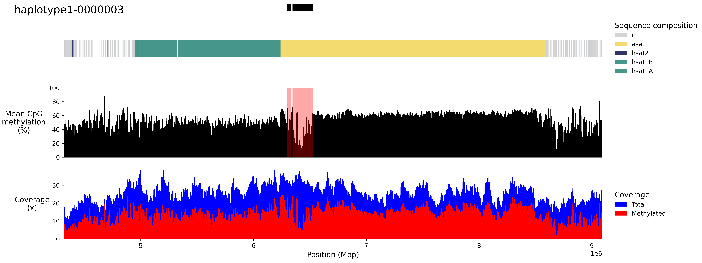

# `CenPlot`
[](https://pypi.org/project/cenplot/)
[](https://github.com/logsdon-lab/cenplot/actions/workflows/main.yaml)
[](https://github.com/logsdon-lab/cenplot/actions/workflows/docs.yaml)

A Python library for producing centromere figures.

<table>
  <tr>
    <td>
      <figure float="left">
          
          <figcaption>CDR plot.</figcaption>
      </figure>
      <figure float="left">
          
          <figcaption>HOR plot.</figcaption>
      </figure>
    </td>
    <td>
      <figure float="left">
          
          <figcaption>Combined plot.</figcaption>
      </figure>
      <figure float="left">
          
          <figcaption>Identity plots.</figcaption>
      </figure>
    </td>
  </tr>
</table>

## Getting Started
Install the package from `pypi`.
```bash
pip install cenplot
```

## CLI
Generating a split HOR tracks using the `cenplot draw` command and an input layout.
```bash
# examples/example_cli.sh
cenplot draw \
-t examples/tracks_hor.toml \
-c "chm13_chr10:38568472-42561808" \
-p 4 \
-d plots \
-o "plot/merged_image.png"
```

## Python API
The same HOR track can be created with a few lines of code.
```python
# examples/example_api.py
from cenplot import plot_tracks, read_tracks

chrom = "chm13_chr10:38568472-42561808"
track_list, settings = read_tracks("examples/tracks_hor.toml", chrom=chrom)
fig, axes, _ = plot_tracks(track_list.tracks, settings)
```

## Development
Requires `Python >= 3.12` and `Git LFS` to pull test files.

Create a `venv`, build `cenplot`, and install it. Also, generate the docs.
```bash
which python3.12 pip
git lfs install && git lfs pull
make dev && make build && make install
pdoc ./cenplot -o docs/
```

The generated `venv` will have the `cenplot` script.
```bash
# source venv/bin/activate
venv/bin/cenplot -h
```

To run tests.
```bash
make test
```

## [Documentation](https://logsdon-lab.github.io/CenPlot/cenplot.html)
Read the documentation [here](https://logsdon-lab.github.io/CenPlot/cenplot.html).

## Cite
**Gao S, Oshima KK**, Chuang SC, Loftus M, Montanari A, Gordon DS, Human Genome Structural Variation Consortium, Human Pangenome Reference Consortium, Hsieh P, Konkel MK, Ventura M, Logsdon GA. A global view of human centromere variation and evolution. bioRxiv. 2025. p. 2025.12.09.693231. [doi:10.64898/2025.12.09.693231](https://doi.org/10.64898/2025.12.09.693231)
